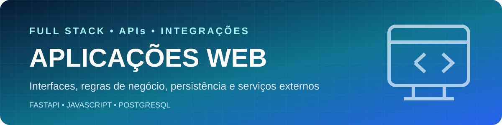

  

  <strong>Aplicações completas que combinam interface, API, regras de negócio, persistência e integrações externas.</strong>

  
  
  
  

  <a href="../README.md">← Voltar ao catálogo principal</a>

## Sobre a categoria

Esta área reúne soluções web organizadas como produtos completos, e não como pastas isoladas de front-end ou back-end. Cada projeto documenta a experiência do usuário, os endpoints, as regras de negócio, a persistência e as dependências externas envolvidas.

## Projetos

| Projeto | Entrega técnica | Tecnologias | Status |
|---|---|---|---|
| [Previsão do Tempo](./Previsao-Tempo) | Consulta meteorológica em tempo real com interface responsiva, API própria e tratamento de falhas externas | FastAPI, HTML, CSS, JavaScript e OpenWeatherMap | Funcional e revisado |
| [Calculadora de Cashback](./Calculadora-Cashback) | Cálculo de cashback e cupons com persistência, histórico por cliente e documentação Swagger | FastAPI, SQLAlchemy, PostgreSQL, HTML e JavaScript | Funcional e revisado |

## Padrão técnico

- Configuração sensível por variáveis de ambiente.
- Validação de entrada no back-end.
- Tratamento de erros de rede, banco e serviços externos.
- Separação clara entre interface, API e persistência.
- Documentação de execução local, endpoints e roadmap.
- Recursos visuais armazenados no `assets` do próprio projeto.

## Navegação rápida

| Objetivo | Projeto recomendado |
|---|---|
| Integração com API externa | [Previsão do Tempo](./Previsao-Tempo) |
| Regras de negócio e persistência | [Calculadora de Cashback](./Calculadora-Cashback) |

## Identidade visual

Azul e ciano representam comunicação, integração e confiabilidade. Os projetos mantêm identidade própria sem perder a consistência visual do catálogo.

## Licença

Os projetos desta categoria são distribuídos sob a [licença MIT](../LICENSE).

## Autor

**Ruan Rabello** — Engenharia da Computação, Back-end, Dados, IA e Automação.

[LinkedIn](https://www.linkedin.com/in/ruan-rabello-da-silva-9032b5274/) · [Portfólio](https://ruanportifolio.lovable.app) · [GitHub](https://github.com/Ruanrabello)