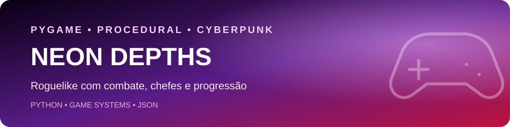

<p align="center">
  
</p>

<p align="center">
  <strong>Roguelike de ação com geração procedural, combate, chefes, progressão e identidade visual neon.</strong>
</p>

<p align="center">
  
  
  
  
</p>

<p align="center">
  <a href="../../README.md">← Voltar ao catálogo de projetos</a>
</p>

## Visão geral

**Neon Depths** é um jogo de ação em perspectiva superior inspirado em roguelikes e shooters arcade. O jogador explora masmorras geradas proceduralmente, enfrenta inimigos com comportamentos diferentes, coleta power-ups e avança por andares cada vez mais difíceis.

O projeto foi estruturado em sistemas independentes para demonstrar organização de código em jogos, gerenciamento de estados, colisões, câmera, áudio, interface, persistência e progressão.

## Principais funcionalidades

| Sistema | Descrição |
|---|---|
| Combate | Mira com mouse, disparos, dano, dash e invencibilidade temporária |
| Geração procedural | Cria salas, corredores, pontos de spawn e saídas de andar |
| Inimigos | Tipos com atributos, perseguição, ataque, desvio e escalonamento |
| Chefes | Bosses em andares definidos pela progressão |
| Progressão | Experiência, níveis, pontuação e aumento de dificuldade |
| Power-ups | Vida, energia, dano, velocidade e escudo |
| Interface | HUD, notificações, números de dano e telas de menu |
| Persistência | Save local, leaderboard e conquistas em JSON |
| Apresentação | Partículas, iluminação, screen shake e áudio procedural |
| Display | Janela redimensionável, tela cheia e suporte a ultrawide com letterbox |

## Arquitetura do projeto

```text
Entrada e estados
      │
      ▼
main.py ─────────────── menu.py
  │                         │
  ├── player.py             ├── configurações
  ├── enemy.py              ├── leaderboard
  ├── bullet.py             └── conquistas
  ├── map.py
  ├── ui.py
  │
  ├── effects/  → partículas e iluminação
  └── utils/    → câmera, áudio, colisão, display e persistência
```

## Estrutura de pastas

```text
Game-Ball/
├── assets/
│   └── neon-depths-header.svg
├── effects/
│   ├── lighting.py
│   └── particles.py
├── utils/
│   ├── achievements.py
│   ├── audio.py
│   ├── camera.py
│   ├── collision.py
│   ├── display.py
│   ├── input_handler.py
│   ├── leaderboard.py
│   ├── save_system.py
│   └── sprites.py
├── main.py
├── settings.py
├── player.py
├── enemy.py
├── bullet.py
├── map.py
├── ui.py
├── menu.py
├── requirements.txt
└── README.md
```

## Controles

| Ação | Controle |
|---|---|
| Movimentação | `WASD` ou setas |
| Mira e disparo | Mouse |
| Dash | Espaço |
| Pausa | `Esc` ou `P` |
| Tela cheia | `F11` |
| Confirmar menus | Enter |

## Como executar localmente

### 1. Clonar o catálogo

```bash
git clone https://github.com/Ruanrabello/Projects.git
cd Projects/Games/Game-Ball
```

### 2. Criar e ativar o ambiente

```bash
python -m venv .venv
```

No Windows:

```powershell
.venv\Scripts\activate
pip install -r requirements.txt
```

No Linux ou macOS:

```bash
source .venv/bin/activate
pip install -r requirements.txt
```

### 3. Iniciar o jogo

```bash
python main.py
```

## Dados locais

Os arquivos de save, leaderboard e conquistas são criados automaticamente dentro de `saves/`. Esses dados pertencem ao ambiente local e não precisam ser versionados.

## Roadmap

- [x] Implementar combate, dash e progressão.
- [x] Criar mapas procedurais e chefes.
- [x] Adicionar save, leaderboard e conquistas.
- [x] Implementar partículas, iluminação e áudio procedural.
- [ ] Adicionar screenshot ou GIF real da jogabilidade.
- [ ] Criar testes para colisões e geração de mapas.
- [ ] Adicionar novos inimigos, armas e biomas.
- [ ] Criar tela de seleção de personagem.
- [ ] Empacotar uma versão executável para Windows.

## Licença

Distribuído sob a [licença MIT](../../LICENSE).

## Autor

**Ruan Rabello** — estudante de Engenharia da Computação com foco em Back-end, Dados, IA e Automação.

[LinkedIn](https://www.linkedin.com/in/ruan-rabello-da-silva-9032b5274/) · [Portfólio](https://ruanportifolio.lovable.app) · [GitHub](https://github.com/Ruanrabello)
