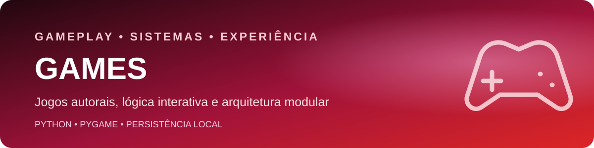

  

  <strong>Jogos autorais para demonstrar lógica, arquitetura modular, experiência do usuário e sistemas interativos.</strong>

  
  
  
  

  <a href="../README.md">← Voltar ao catálogo principal</a>

## Sobre a categoria

Esta área reúne projetos de jogos usados para praticar e demonstrar gerenciamento de estados, colisões, entrada do usuário, inteligência de inimigos, geração procedural, persistência e feedback audiovisual.

## Projetos

| Projeto | Entrega técnica | Tecnologias | Status |
|---|---|---|---|
| [Neon Depths — Game Ball](./Game-Ball) | Roguelike cyberpunk com combate, mapas procedurais, chefes, progressão, conquistas, leaderboard e salvamento local | Python, Pygame e JSON | Funcional |

## Sistemas demonstrados

- Loop principal e gerenciamento de estados.
- Câmera, colisões e suporte a diferentes resoluções.
- Inimigos, projéteis, progressão e chefes.
- Geração procedural de mapas e sprites.
- Partículas, iluminação, áudio e feedback de impacto.
- Persistência local de save, ranking e conquistas.

## Qualidade e evolução

O código é dividido por responsabilidade para reduzir acoplamento e facilitar a evolução de novos inimigos, armas, mapas e telas. O próximo ganho de maturidade será adicionar testes para colisões e geração procedural, além de uma demonstração real em GIF.

## Identidade visual

Vermelho e rosa neon reforçam a atmosfera arcade e cyberpunk, enquanto o README do projeto detalha arquitetura, controles, execução e roadmap.

## Licença

Os projetos desta categoria são distribuídos sob a [licença MIT](../LICENSE).

## Autor

**Ruan Rabello** — Engenharia da Computação, Back-end, Dados, IA e Automação.

[LinkedIn](https://www.linkedin.com/in/ruan-rabello-da-silva-9032b5274/) · [Portfólio](https://ruanportifolio.lovable.app) · [GitHub](https://github.com/Ruanrabello)