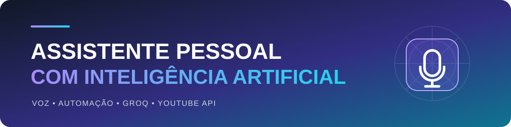

<p align="center">
  
</p>

<p align="center">
  <strong>Assistente pessoal em Python com comandos de voz, síntese de fala, automações e respostas geradas por IA.</strong>
</p>

<p align="center">
  
  
  
  
  
</p>

<p align="center">
  <a href="../../README.md">← Voltar ao catálogo de projetos</a>
</p>

## Visão geral

O **Assistente Pessoal** recebe comandos iniciados por uma palavra de ativação, responde por áudio, abre sites e programas, pesquisa vídeos, consulta a Groq e mantém um histórico local das conversas.

A estrutura separa configuração, voz, comandos, IA e persistência. Integrações opcionais são inicializadas somente quando usadas, evitando que uma chave ausente ou um dispositivo indisponível impeça todo o programa de iniciar.

## Principais funcionalidades

| Recurso | Descrição |
|---|---|
| Palavra de ativação | Aceita wake words configuráveis no `.env` |
| Reconhecimento de voz | Possui timeout e limite de duração da frase |
| Síntese de fala | Inicialização tardia e fallback para texto no console |
| Comandos locais | Abre navegador, YouTube, Google e calculadora no Windows |
| Integração com IA | Usa modelo da Groq configurável por ambiente |
| Busca de vídeos | Cria o cliente da YouTube API somente quando necessário |
| Histórico | Valida mensagens e salva o JSON de forma atômica |
| Tratamento de falhas | Erros de voz, áudio e serviços externos não encerram o loop principal |

## Arquitetura

```text
Microfone
   │
   ▼
Reconhecimento + wake word
   │
   ├── comando local ──► sistema operacional / navegador
   │
   └── pergunta ───────► Groq API
                           │
                           ▼
                    resposta textual
                           │
                           ├── histórico JSON
                           └── síntese de fala
```

## Estrutura

```text
Assistente-Pessoal/
├── Config/
│   └── keys.py
├── Core/
│   ├── comandos.py
│   ├── historico.py
│   ├── ia.py
│   └── voz.py
├── data/
├── assets/
│   └── assistant-header.svg
├── main.py
├── .env.example
├── requirements.txt
└── README.md
```

## Como executar localmente

```bash
git clone https://github.com/Ruanrabello/Projects.git
cd Projects/IA-e-Automacao/Assistente-Pessoal
python -m venv .venv
```

No Windows:

```powershell
.venv\Scripts\activate
pip install -r requirements.txt
copy .env.example .env
```

No Linux ou macOS:

```bash
source .venv/bin/activate
pip install -r requirements.txt
cp .env.example .env
```

Configure o `.env`:

```env
GROQ_API_KEY=sua_chave_groq
GROQ_MODEL=llama-3.1-8b-instant
YOUTUBE_API_KEY=sua_chave_youtube_opcional
WAKE_WORDS=jarvis,jarbas,jarvi
VOICE_RATE=200
VOICE_VOLUME=1.0
```

Inicie:

```bash
python main.py
```

## Segurança e privacidade

- O `.env` e o histórico local não são versionados.
- Mensagens de falha da API não são gravadas como respostas da IA.
- O cliente da YouTube API só é criado quando uma pesquisa é solicitada.
- Comandos que controlam o sistema devem ser revisados antes de receber novas permissões.

## Limitações atuais

- Os comandos locais são mais completos no Windows.
- O reconhecimento do Google requer conexão com a internet.
- O histórico ainda não possui sincronização com banco ou nuvem.
- O projeto ainda não possui testes automatizados.

## Roadmap

- [x] Carregar configurações pelo `.env`.
- [x] Implementar timeout de voz e fallback de áudio.
- [x] Inicializar integrações opcionais sob demanda.
- [x] Tornar a persistência do histórico mais segura.
- [ ] Criar testes automatizados.
- [ ] Tornar comandos independentes do sistema operacional.
- [ ] Adicionar interface visual.
- [ ] Organizar comandos como plugins.

## Licença

Distribuído sob a [licença MIT](../../LICENSE).

## Autor

**Ruan Rabello** — estudante de Engenharia da Computação com foco em Back-end, Dados, IA e Automação.

[LinkedIn](https://www.linkedin.com/in/ruan-rabello-da-silva-9032b5274/) · [Portfólio](https://ruanportifolio.lovable.app) · [GitHub](https://github.com/Ruanrabello)
