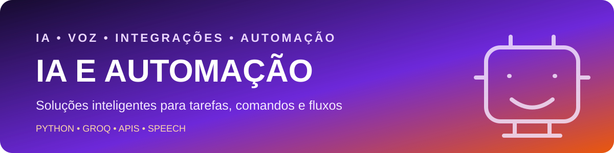

  

  <strong>Soluções que combinam inteligência artificial, comandos, voz, integrações e automação de tarefas.</strong>

  
  
  
  

  <a href="../README.md">← Voltar ao catálogo principal</a>

## Sobre a categoria

Esta área concentra projetos que transformam comandos e dados em ações automatizadas. A prioridade é manter integrações desacopladas, credenciais fora do código, tratamento de falhas e uma estrutura que permita adicionar novos recursos sem concentrar toda a lógica em um único arquivo.

## Projetos

| Projeto | Entrega técnica | Tecnologias | Status |
|---|---|---|---|
| [Assistente Pessoal](./Assistente-Pessoal) | Assistente por voz com síntese de fala, comandos locais, respostas por IA, pesquisa de vídeos e histórico persistente | Python, Groq, SpeechRecognition e YouTube Data API | Protótipo funcional e revisado |

## Padrão técnico

- Chaves carregadas por variáveis de ambiente.
- Separação entre entrada de voz, comandos, IA e persistência.
- Tratamento de falhas de microfone e serviços externos.
- Histórico local mantido fora do versionamento.
- Roadmap orientado a testes, plugins e portabilidade entre sistemas.

## Segurança e privacidade

Projetos de automação podem executar ações locais. Por isso, permissões, comandos e integrações devem ser revisados antes da expansão para novos recursos ou ambientes.

## Identidade visual

Roxo representa IA e criatividade; laranja representa ação e automação. Cada projeto mantém recursos visuais dentro do próprio `assets`.

## Licença

Os projetos desta categoria são distribuídos sob a [licença MIT](../LICENSE).

## Autor

**Ruan Rabello** — Engenharia da Computação, Back-end, Dados, IA e Automação.

[LinkedIn](https://www.linkedin.com/in/ruan-rabello-da-silva-9032b5274/) · [Portfólio](https://ruanportifolio.lovable.app) · [GitHub](https://github.com/Ruanrabello)