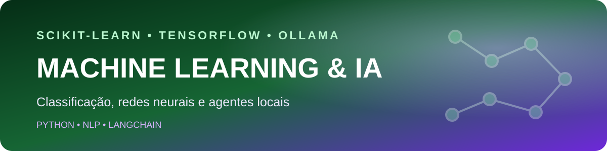

<p align="center">
  
</p>

<p align="center">
  <strong>Laboratório de classificação, processamento de texto, redes neurais e agentes locais com IA.</strong>
</p>

<p align="center">
  
  
  
  
  
</p>

<p align="center">
  <a href="../../README.md">← Voltar ao catálogo de projetos</a>
</p>

## Visão geral

O **Machine Learning & IA** reúne estudos aplicados que mostram a evolução entre modelos clássicos, redes neurais e agentes locais. Cada script pode ser executado separadamente, permitindo comparar técnicas, dados de entrada e resultados.

O objetivo é documentar de forma prática conceitos como preparação de dados, vetorização de texto, divisão entre treino e teste, classificação, avaliação de modelos e uso de modelos locais por meio do Ollama.

## Projetos incluídos

| Área | Arquivo | Objetivo |
|---|---|---|
| Agente básico | `Agentes/App_v1.py` | Realizar uma chamada simples a um modelo local |
| Agente com histórico | `Agentes/App_v2.py` | Manter o contexto da conversa |
| Agente com persona | `Agentes/App_v3.py` | Aplicar instruções de sistema ao assistente |
| Classificação Iris | `Modelos/Ml_iris.py` | Classificar flores com regressão logística |
| Detecção de spam | `Modelos/NB_RN.py` | Comparar Naive Bayes e rede neural |
| Toxicidade | `Modelos/RN_RL.py` | Comparar regressão logística e rede neural em textos |

## Principais conceitos demonstrados

- Preparação e padronização de dados.
- Divisão entre treino e teste.
- Vetorização de textos com `CountVectorizer`.
- Regressão logística e Naive Bayes.
- Redes neurais com TensorFlow/Keras.
- Métricas de acurácia.
- Agentes locais com LangChain e Ollama.
- Histórico de mensagens e prompt de sistema.

## Arquitetura dos experimentos

```text
Dataset ou texto
      │
      ▼
Preparação e vetorização
      │
      ▼
Treino / teste
      │
      ▼
Modelo clássico ou rede neural
      │
      ▼
Métricas e previsões
```

```text
Prompt do usuário
      │
      ▼
LangChain
      │
      ▼
Ollama + modelo local
      │
      ▼
Resposta e histórico
```

## Estrutura de pastas

```text
Machine-Learning-IA/
├── Agentes/
│   ├── App_v1.py
│   ├── App_v2.py
│   └── App_v3.py
├── Modelos/
│   ├── Bases/
│   │   ├── Toxic_Comments.csv
│   │   └── iris.csv
│   ├── Ml_iris.py
│   ├── NB_RN.py
│   └── RN_RL.py
├── assets/
│   └── machine-learning-header.svg
├── requirements.txt
└── README.md
```

## Como executar localmente

### 1. Clonar o catálogo

```bash
git clone https://github.com/Ruanrabello/Projects.git
cd Projects/Machine-Learning/Machine-Learning-IA
```

### 2. Criar o ambiente

```bash
python -m venv .venv
```

No Windows:

```powershell
.venv\Scripts\activate
pip install -r requirements.txt
```

No Linux ou macOS:

```bash
source .venv/bin/activate
pip install -r requirements.txt
```

### 3. Executar um modelo

```bash
python Modelos/Ml_iris.py
python Modelos/NB_RN.py
python Modelos/RN_RL.py
```

### 4. Executar os agentes locais

Mantenha o Ollama em execução e instale o modelo usado pelos scripts:

```bash
ollama pull gemma4:latest
python Agentes/App_v3.py
```

## Limitações atuais

- Os datasets são pequenos e voltados ao aprendizado.
- Os resultados não representam modelos prontos para produção.
- Alguns exemplos ainda concentram preparação, treino e avaliação no mesmo arquivo.
- O classificador de toxicidade ainda precisa usar o dataset por caminho relativo em todos os ambientes.

## Roadmap

- [x] Adicionar exemplos de regressão logística e Naive Bayes.
- [x] Comparar modelos clássicos e redes neurais.
- [x] Criar agentes locais com histórico e instrução de sistema.
- [ ] Corrigir definitivamente caminhos locais restantes.
- [ ] Separar treino, avaliação e inferência em módulos.
- [ ] Adicionar matrizes de confusão e relatórios de classificação.
- [ ] Criar notebooks com visualizações.
- [ ] Adicionar testes e reprodutibilidade por seed.

## Licença

Distribuído sob a [licença MIT](../../LICENSE).

## Autor

**Ruan Rabello** — estudante de Engenharia da Computação com foco em Back-end, Dados, IA e Automação.

[LinkedIn](https://www.linkedin.com/in/ruan-rabello-da-silva-9032b5274/) · [Portfólio](https://ruanportifolio.lovable.app) · [GitHub](https://github.com/Ruanrabello)
