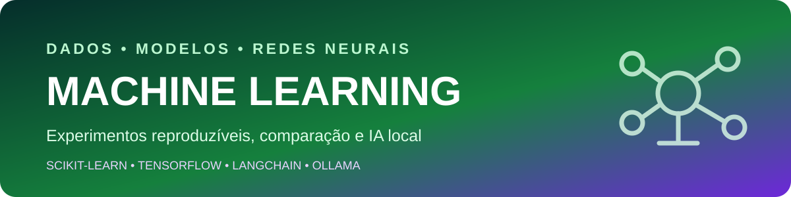

  

  <strong>Estudos aplicados em preparação de dados, classificação, redes neurais e agentes locais.</strong>

  
  
  
  

  <a href="../README.md">← Voltar ao catálogo principal</a>

## Sobre a categoria

Esta área reúne experimentos reproduzíveis para comparar técnicas de aprendizado de máquina e inteligência artificial local. Os exemplos priorizam clareza, datasets versionados no próprio projeto e execução independente de caminhos específicos do computador do autor.

## Projetos

| Projeto | Entrega técnica | Tecnologias | Status |
|---|---|---|---|
| [Machine Learning & IA](./Machine-Learning-IA) | Laboratório de classificação de flores, spam e toxicidade, além de agentes locais com histórico e instruções de sistema | Python, Pandas, NumPy, Scikit-learn, TensorFlow, LangChain e Ollama | Estudos aplicados |

## Competências demonstradas

- Preparação e validação de datasets.
- Divisão entre treino e teste.
- Vetorização e classificação de texto.
- Comparação entre modelos clássicos e redes neurais.
- Avaliação por métricas e previsões.
- Execução de modelos locais por meio do Ollama.
- Evolução de agentes com memória e prompt de sistema.

## Critérios de evolução

O próximo nível de maturidade inclui separar treino, avaliação e inferência; registrar métricas de forma consistente; adicionar seeds; criar notebooks de análise e implementar testes para carregamento e transformação de dados.

## Identidade visual

Verde representa dados e aprendizado; roxo representa IA. O projeto interno possui banner, arquitetura, instruções de execução e roadmap próprios.

## Licença

Os projetos desta categoria são distribuídos sob a [licença MIT](../LICENSE).

## Autor

**Ruan Rabello** — Engenharia da Computação, Back-end, Dados, IA e Automação.

[LinkedIn](https://www.linkedin.com/in/ruan-rabello-da-silva-9032b5274/) · [Portfólio](https://ruanportifolio.lovable.app) · [GitHub](https://github.com/Ruanrabello)