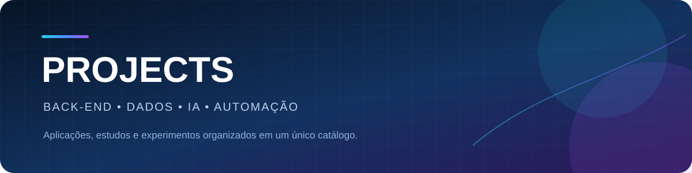

  

  <strong>Catálogo de projetos práticos, protótipos e estudos aplicados de desenvolvimento.</strong>

  
  
  
  
  
  

## Sobre o repositório

O **Projects** reúne aplicações menores, laboratórios, protótipos funcionais e estudos utilizados para praticar arquitetura de software, APIs, inteligência artificial, dados, automação e interfaces.

Projetos grandes e com identidade própria são mantidos em repositórios dedicados. Este repositório funciona como um catálogo central, evitando vários repositórios pequenos e sem contexto.

## Projetos principais

| Projeto | Descrição | Tecnologias | Status |
|---|---|---|---|
| [Enterprise AI Assistant](https://github.com/Ruanrabello/enterprise-ai-assistant) | Plataforma full stack de IA corporativa com histórico, configuração de modelos e base para RAG | FastAPI, React, PostgreSQL, Ollama, Gemini e Grok | Projeto principal |
| [Excel VBA Projects](https://github.com/Ruanrabello/Excel-vba-projects) | Coleção de automações para relatórios, tratamento de dados, PDFs e integração com Outlook | Excel e VBA | Repositório dedicado |

## Catálogo interno

### 🤖 Inteligência Artificial · `#7C3AED`

Projetos com modelos de linguagem, reconhecimento de voz, machine learning e automações inteligentes.

| Projeto | Descrição | Tecnologias | Status |
|---|---|---|---|
| [Assistente Pessoal](./Assistente-Pessoal-main) | Assistente por voz capaz de executar comandos locais, consultar IA, buscar vídeos e manter histórico | Python, Groq, voz e YouTube API | Protótipo funcional |
| [Machine Learning & IA](./MachineLearnind_IA_Projects) | Laboratório de classificação, análise de dados e experimentos com modelos de aprendizado de máquina | Python, Pandas e Scikit-learn | Estudos aplicados |

### 🌐 Back-end e APIs · `#2563EB`

Projetos voltados a regras de negócio, consumo de serviços, persistência e construção de APIs.

| Projeto | Descrição | Tecnologias | Status |
|---|---|---|---|
| [Calculadora de Cashback](./Calculadora_Cashback) | Aplicação para calcular cashback e praticar regras de negócio expostas por API | Python e API REST | Concluído |
| [Previsão do Tempo](./Previsao-Tempo) | Aplicação que consulta dados meteorológicos em API e apresenta as informações em uma interface web | Python, HTML, CSS e JavaScript | Concluído |

### 💻 Front-end · `#0891B2`

Interfaces e experimentos voltados à apresentação de dados e interação com usuários.

| Projeto | Descrição | Tecnologias | Status |
|---|---|---|---|
| [Previsão do Tempo](./Previsao-Tempo) | Interface web para consulta e exibição de informações meteorológicas | HTML, CSS e JavaScript | Concluído |

### 📊 Dados · `#16A34A`

Estudos de manipulação, análise, classificação e interpretação de dados.

| Projeto | Descrição | Tecnologias | Status |
|---|---|---|---|
| [Machine Learning & IA](./MachineLearnind_IA_Projects) | Notebooks e scripts para praticar preparação de dados e modelos de classificação | Python, Pandas e Scikit-learn | Laboratório |

### ⚙️ Automação · `#EA580C`

Soluções para reduzir tarefas repetitivas, integrar serviços e executar ações locais.

| Projeto | Descrição | Tecnologias | Status |
|---|---|---|---|
| [Assistente Pessoal](./Assistente-Pessoal-main) | Automatiza comandos locais e interações por voz com apoio de IA | Python e APIs | Protótipo funcional |

### 🎮 Games · `#DC2626`

Projetos utilizados para praticar lógica, eventos, movimentação e orientação a objetos.

| Projeto | Descrição | Tecnologias | Status |
|---|---|---|---|
| [Game Ball](./Game-BallBasic) | Jogo simples criado para praticar eventos, colisões e lógica de atualização em tempo real | Python e Pygame | Concluído |

## Como explorar

1. Escolha uma categoria ou projeto nas tabelas.
2. Abra a pasta correspondente.
3. Leia o README específico antes de executar.
4. Instale as dependências em um ambiente isolado.
5. Utilize apenas arquivos `.env.example` como modelo e mantenha credenciais localmente.

## Padrão visual

Cada categoria possui uma cor para facilitar a leitura do catálogo:

| Categoria | Cor |
|---|---|
| Inteligência Artificial | Roxo `#7C3AED` |
| Back-end e APIs | Azul `#2563EB` |
| Front-end | Ciano `#0891B2` |
| Dados | Verde `#16A34A` |
| Automação | Laranja `#EA580C` |
| Games | Vermelho `#DC2626` |
| Estudos gerais | Cinza `#64748B` |

## Boas práticas aplicadas

- Dependências geradas, ambientes virtuais, caches, builds e bancos locais não são versionados.
- Credenciais e chaves devem ser fornecidas por variáveis de ambiente.
- Projetos maiores recebem um repositório próprio e permanecem referenciados neste catálogo.
- Cada projeto relevante deve possuir descrição, tecnologias, estado atual e instruções próprias.

## Próximas melhorias

- [x] Remover dependências e arquivos gerados do histórico atual do repositório
- [x] Separar o Enterprise AI Assistant em um repositório dedicado
- [x] Criar identidade visual para o catálogo
- [x] Adicionar descrições aos projetos listados
- [ ] Revisar o código de cada projeto e corrigir erros claros de execução
- [ ] Criar ou atualizar READMEs internos restantes
- [ ] Adicionar screenshots aos projetos com interface
- [ ] Padronizar nomes de pastas sem quebrar links existentes

## Autor

**Ruan Rabello** — estudante de Engenharia da Computação com foco em Back-end, Dados, IA e Automação.

[LinkedIn](https://www.linkedin.com/in/ruan-rabello-da-silva-9032b5274/) · [Portfólio](https://ruanportifolio.lovable.app) · [GitHub](https://github.com/Ruanrabello)

## Licença

Distribuído sob a [licença MIT](./LICENSE).
